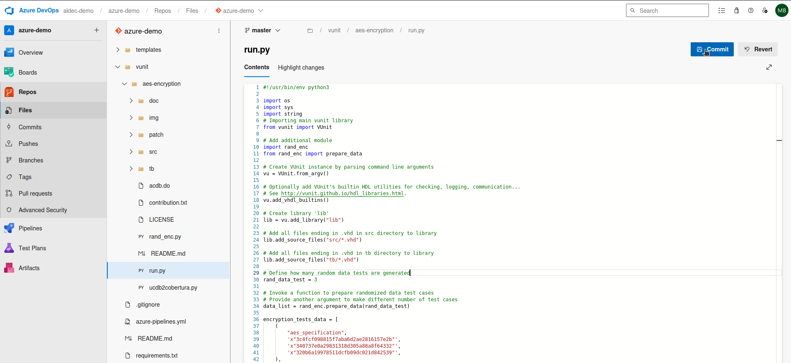
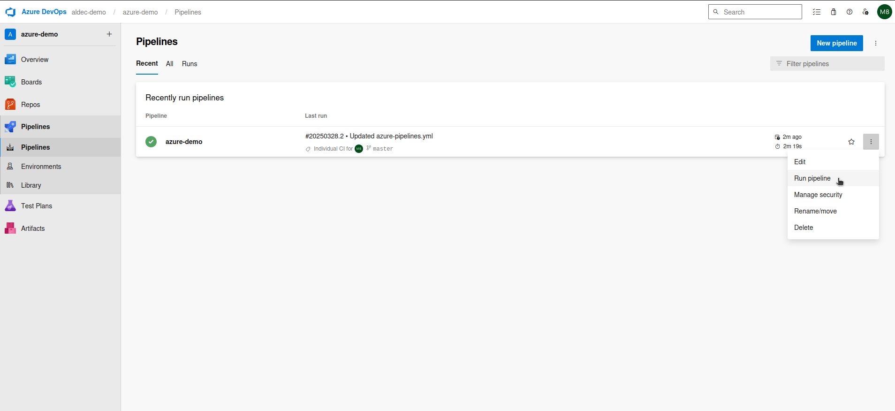
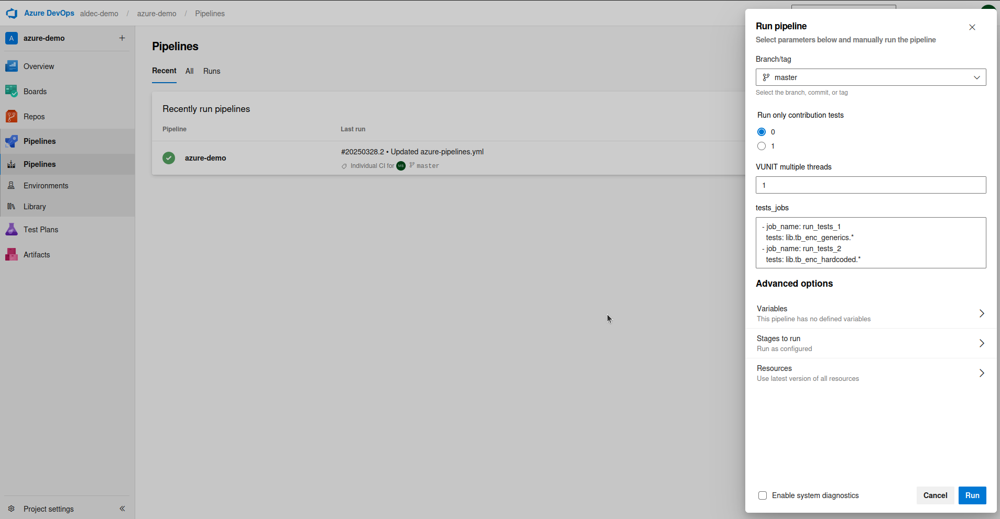
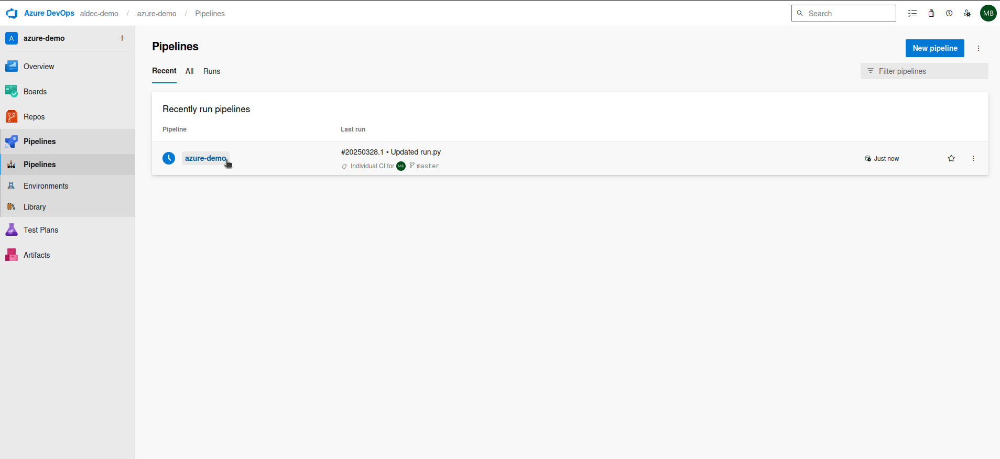
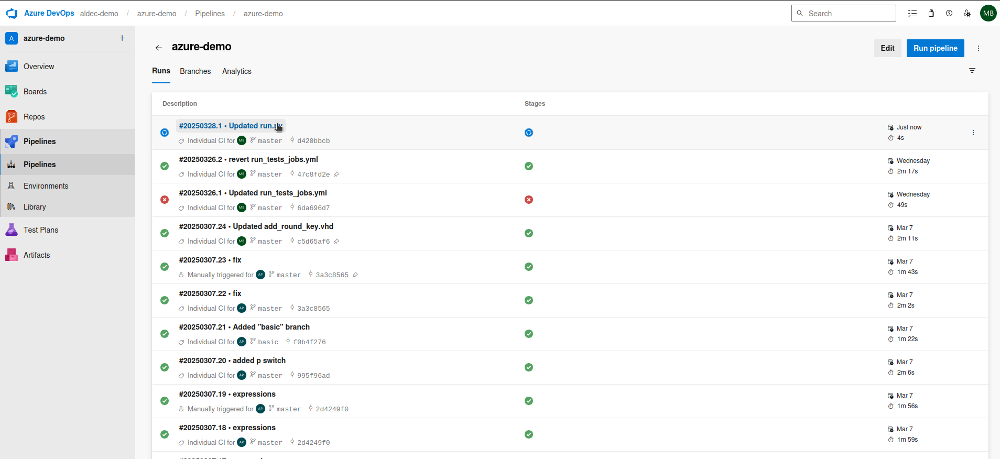
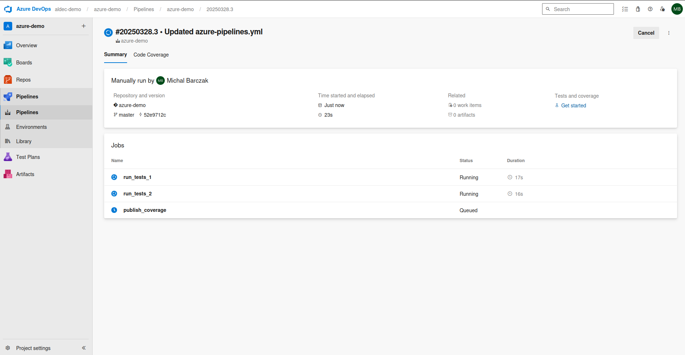
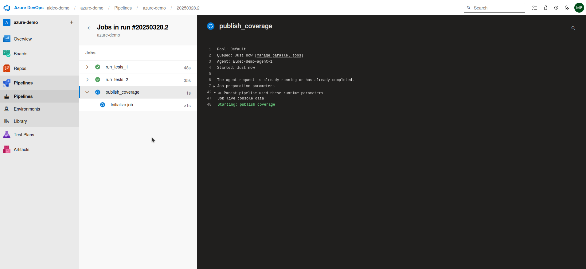
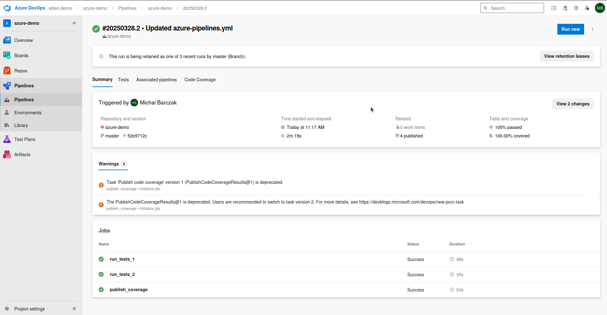
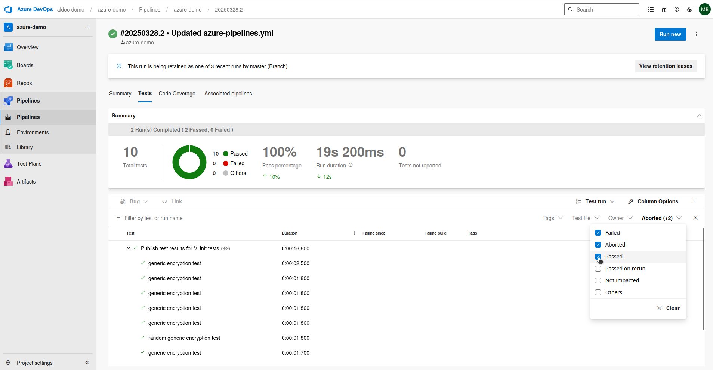
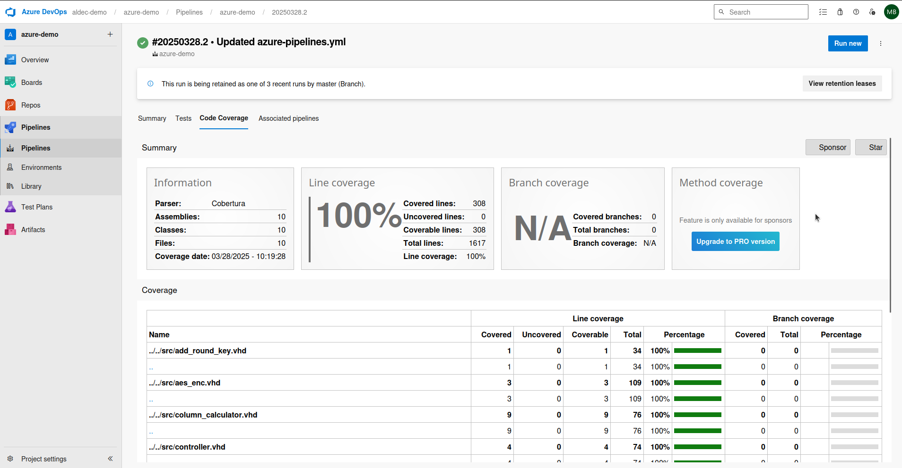

# Azure-demo

## 1. Requirements

* Azure DevOps Repository
* Docker Image with Riviera-PRO 2024.10 and VUnit dependencies
* Virtual Machine with set up Azure Pipelines Agent

## 2. Set Up Process

To upload sources to Azure DevOps repository it is prefferable to choose one of the following options:
1. Upload all the files from this repository to Azure Repository
2. [Import a Git repository to Azure Repository](https://learn.microsoft.com/en-us/azure/devops/repos/git/import-git-repository?view=azure-devops)

Preparing a Docker Image with Riviera-PRO and VUnit dependencies is similar to the one described in one of the [Aldec's Application Notes](https://www.aldec.com/en/support/resources/documentation/articles/2259). For more details please contact Aldec's support.

Setting Virtual machines and installing Azure Pipelines Agent can be done manually or autimaticly. Depends on your choice please follow [this guideline](https://learn.microsoft.com/en-us/azure/devops/pipelines/agents/pools-queues?view=azure-devops&tabs=yaml%2Cbrowser) to process.

## 3. Running the Example

This project implements CI/CD functionality to automate the pipeline execution. There are several ways to run the example:

1. Make a commit/push to a specific branch to trigger the pipeline automatically

2. You can also run the pipeline manually

3. And then set up its parameters

4. After triggering the pipeline, navigate to the pipelines section and select the "azure-demo" pipeline

5. Select the newest pipeline run from the list

6. During execution, you'll see that the pipeline runs 2 jobs in parallel:

7. After the test execution jobs finish, a third job runs to merge the results and publish them in Cobertura format.

8. Once all three jobs complete, go to the Summary tab for an overview:

9. In the summary, you can find additional tabs for viewing detailed results. To access the results of the VUnit tests, go to the Tests tab and apply a filter for passed tests.

10. Check the Code Coverage tab for line coverage metrics.

