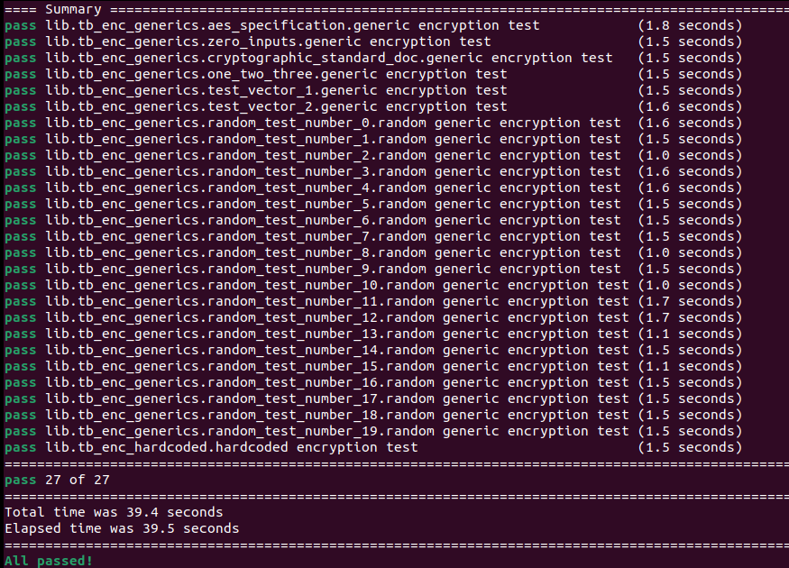
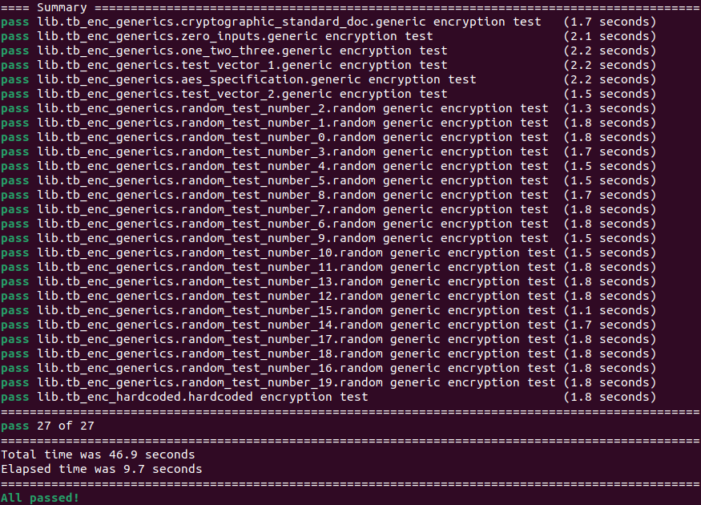
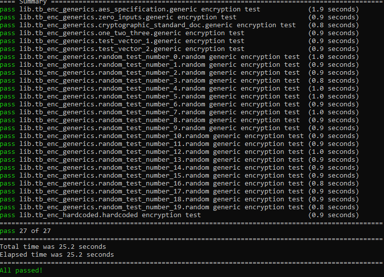
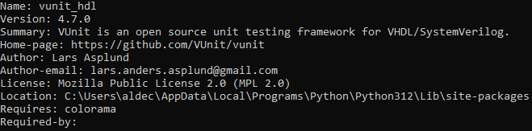
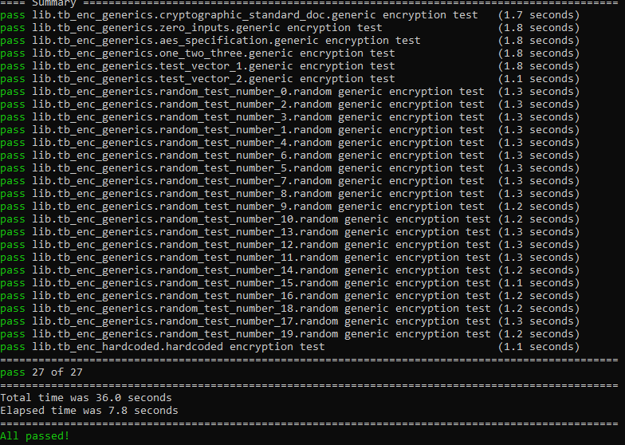
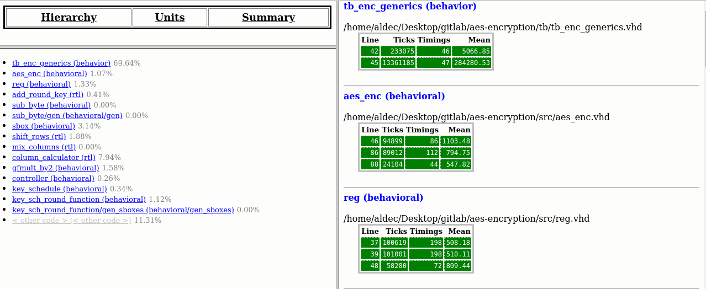
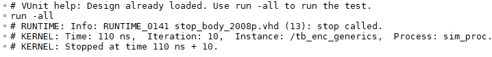
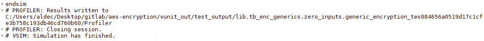
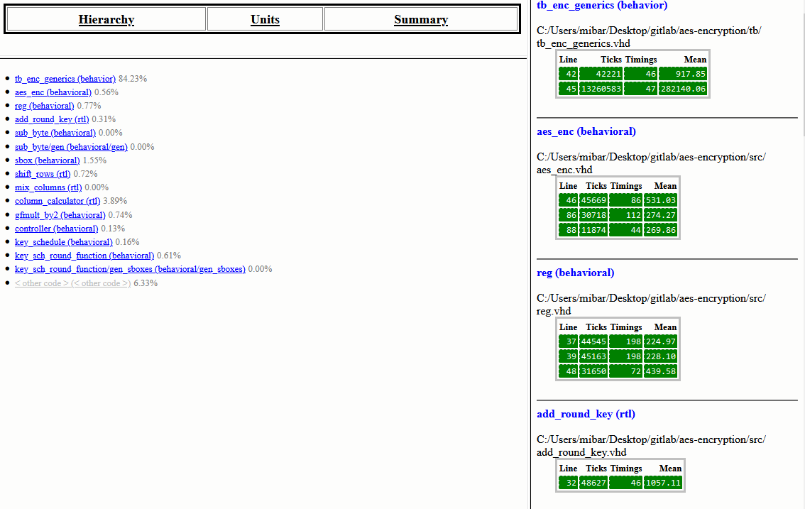

# AES Encryption

## 1. Requirements

* Riviera-PRO 2024.04 or newer
* Python 3.8 or newer
* Ubuntu 2022.04 or newer

OR

* Active-HDL 15.0
* Python 3.8 or newer
* Windows 10 or newer

### Verified with:

 - VUnit 4.7.0, Riviera-PRO 2024.04-x64/2024.10-x64, Ubuntu 22.04.4/24.04.1 LTS and Python 3.10.11/3.11.10/3.12.3
 
 - VUnit 4.7.0, Active-HDL 15.0-x64, Windows 10/11 and Python 3.12.4/3.12.6.

## 2. Installation Python Packages

Install necessary packages using command below:

**2.1.** 
         ```console
         pip install -r requirements.txt
         ```

## 3. Running an Example

### 3.1 Running with Riviera-PRO

Set up the environment variable and run the example following steps below:

**3.1.1.** ```cd aes_encryption```

**3.1.2.** ```export PATH=<Riviera-PRO_installation_directory>/bin:$PATH```

**3.1.3.** ```python3 run.py```



**Figure 1:** Console view after running test with Riviera-PRO.

To run example with multiple threads use -p option following by the thread nubmer.

**3.1.4.** ```python3 run.py -p <thread_number>```



**Figure 2:** Console view after running test with Riviera-PRO using five threads.

### 3.2 Running with Active-HDL

Set up the environment varable and run the example following steps below:

**3.2.1** ```cd aes_encryption```

**3.2.2** ```set PATH=<Active-HDL_installation_directory>\bin:%PATH%```

**3.2.3** ```python run.py```



**Figure 3:** Console view after running test with Active-HDL.

To run example with multiple threads firstly patch need to be applied. Find the vunit_hdl package location.

**3.2.4** ```pip show vunit_hdl```




**Figure 4:** VUnit Package location in Windows OS.

Replace the 'activehdl.py' in <vunit_hdl_location>/vunit_sim_if with the file aes-encryption/patch/activehdl.py. After replacement of the patch file use -p option following by the thread number to run the example with multiple threads.

**3.2.5** ```python run.py -p <thread_number>```



**Figure 5:** Console view after running test with Active-HDL using five threads.

## 4. Logic Data Profiling

### 4.1. Using Riviera-PRO Logic Data Profiler

To use logic data profiler with Riviera-PRO generate profiler report. Following steps will guide you through the whole process.

**4.1.1.** Run the run.py script to generate profiler output files

```python3 run.py```

**4.1.2.** Run the Riviera-PRO simulator in aes-encryption directory

**4.1.3.** In the Riviera-PRO console type below command to generate profiler report

```profiler report -tbp $curdir/profiling_data/<specific_test_directory>/profiler.tbp -html <profiler_report_name>.html```

Profiler Report will be stored in the aes-encryption directory.

**4.1.4.** Open Profiler Report file for review the profiling results



**Figure 6:** Example Profiler Report in Riviera-PRO.

### 4.2 Using Active-HDL Logic Data Profiler

To use logic data profiler with Active-HDL apply the necessary patch and generate profiler report. Following steps will guide you through the whole process starting from localize vunit_hdl package and replacing necessary files. 

**4.2.1.** pip show vunit_hdl


**Figure 7:** Vunit Package location in Windows OS.

**4.2.2.** Replace file named 'activehdl.py' in <vunit_hdl_location>/vunit/sim_if with the file 'activehdl.py' from aes-encryption/patch directory.

**4.2.3.** Run the run.py script in GUI mode

```python run.py -g```

**4.2.4.** Run the VUnit simulation via Active-HDL console

```run -all```



**Figure 8:** Running Vunit simulation in Active-HDL.

**4.2.5** Stop the simulation to obtain Profiler results

```endsim```



**Figure 9:** Stopping VUnit sinulation in Active-HDL.

**4.2.6.** In the Active-HDL console type the following command to generate profiler report:

```profiler report -tbp $dsn/../../../../../../profiling_data/<specific_test_directory>/profiler.tbp -html $dsn/../../../../../../<profiler_report_name>.html```

Profiler Report will be stored in the aes-encryption directory.

**4.2.7.** Open Profiler Report file for review the profiling results



**Figure 10:** Example Profiler Report in Active-HDL.
